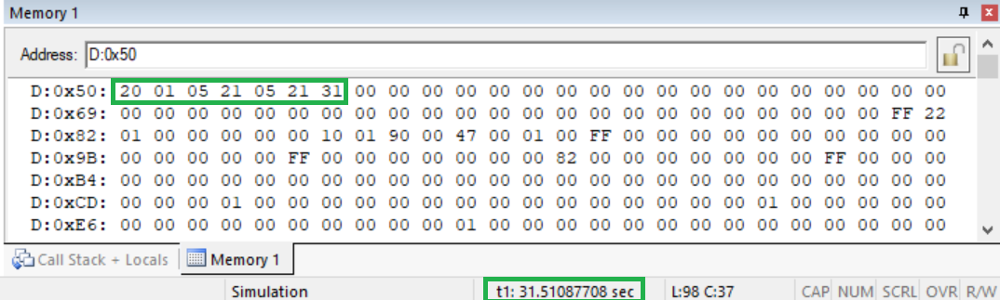
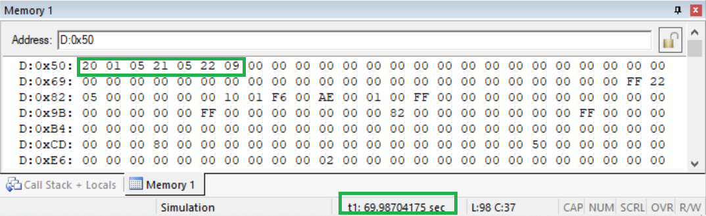
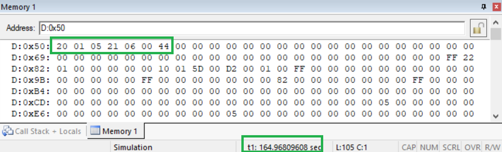
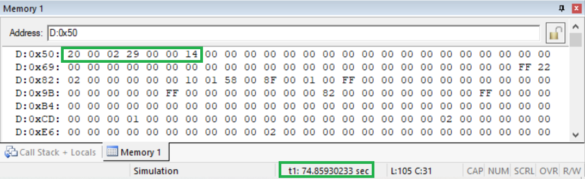

## 								<center>实时时钟</center>


<h5>
    <center>2021-5-6 </center>  
</h5>             


##### 

##### <center>混合1902</center>


##### <center>余丛杉</center>


##### <center>3190103165</center>


### 要求

> + 在Keil仿真环境中编写程序，实现一个实时时钟；
>
> + 从默认时间点开始计时；
>
> + 必须使用中断响应程序来处理；
>
> + 计时结果（年、月、日、时、分、秒）


### 思路

+ 设置存储单元，地址从`0x50`开始

  + `ms_50`  -  每50ms ++
  + `second` - 每1s ++
  + `minute` - 每1min ++
  + `hour` - 每1h ++
  + `day` - 每一天 ++
  + `month` - 每一个月 ++
  + `year` - 每一年++

+ 在中断函数`void timer0(void) interrupt 1`中，对存储单元进行++操作

  + 初值设置
    $$
    X = 65536-50000 =15536=3CB0H
    $$

    + `TH0 = 0x3C;
      `
    + `TL0 = 0xB0;`

  + 在`bit JudgeDays(void)`处理闰年的问题

    + 创建表`unsigned char xdata Date[2][12] `，查询即可

+ 结果可视化

  + 在`unsigned char Decimal(unsigned char hex)`函数中把十六进制显示为十进制
  + 在`0x50`~`0x56`显示时间


### 调试结果

> + 设置默认时间为2001年5月21日 05:21:00
> + 下方显示有运行时间，可以此时间作为依据判断时钟运行是否准确

+ **秒进位**



+ **分钟进位**




> 设置默认时间为2001年5月21日 05:58:00

+ **小时进位**




> 设置默认时间为2000年2月28日 23:59:00

+ **闰年日进位**




> 实验结果都符合预期


### 代码

```c
#include<reg51.h>

// set initial year, month, day, hour, minute, second
// set initial time2000.2.28 23:59:00
unsigned char data year = 0;
unsigned char data month = 2;
unsigned char data day = 28;
unsigned char data hour = 23;
unsigned char data minute = 59;
unsigned char data second = 0;
unsigned char data ms_50 = 0;

// days of month table
unsigned char xdata Date[2][12] =  {
	{31,28,31,30,31,30,31,31,30,31,30,31},
	{31,29,31,30,31,30,31,31,30,31,30,31}
};
	

void Set(void)
{
	EA = 1;
	ET0 = 1;
	TMOD = 0x01;
	TH0 = 0x3C;
	TL0 = 0xB0;
	TR0 = 1;
	TF0 = 0;
}

// Determine whether it is a leap year, 
// if it is true, return 1, otherwise return 0
bit JudgeDays(void)
{
	unsigned int Year = 2000 + year;
	bit flag = 0;
	if( (Year % 400) == 0 || (Year % 4 ==0 && Year % 100 != 0 ))
		flag = 1;
	return flag;
}

// interrupt program
void timer0(void) interrupt 1
{
	// reset 
	TH0 = 0x3C;
	TL0 = 0xB0;
	TF0 = 0;
	
	// Trigger interrupt, indicating overflow, it is 50ms
	ms_50++;
	if( ms_50 == 20 )
	{
		ms_50 = 0;
		second++;
	}
	
	// minute++;
	if( second == 60 )
	{
		second = 0;
		minute++;
	}
	
	// hour++;
	if( minute == 60 )
	{
		minute = 0;
		hour++;
	}
	
	// day++;
	if( hour == 24 )
	{
		hour = 0;
		day++;
	}
	
	// month++;
	if( day == Date[JudgeDays()][month-1]+1 )
	{
		day = 1;
		month++;
	}
	
	// year++;
	if( month == 13 )
	{
		month = 1;
		year++;
	}
}

// Display time as decimal
unsigned char Decimal(unsigned char hex)
{
	return 16*(hex/10)+hex%10;
}
	
void main(void)
{
	// Show time at 0x50
	code unsigned char* show_place = 0x50;	
	// Show the year as 2000+
	show_place[0] = Decimal(20);
	
	Set();
	
	while(1){
		show_place[1] = Decimal(year);
		show_place[2] = Decimal(month);
		show_place[3] = Decimal(day);
		show_place[4] = Decimal(hour);
		show_place[5] = Decimal(minute);
		show_place[6] = Decimal(second);
	};	
}
```

