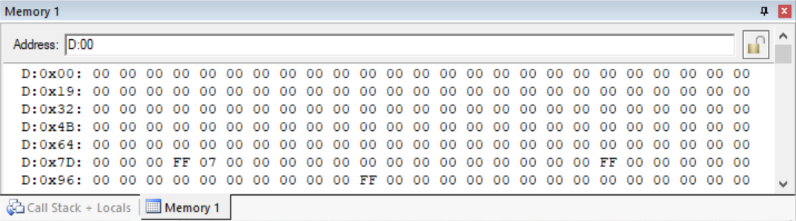
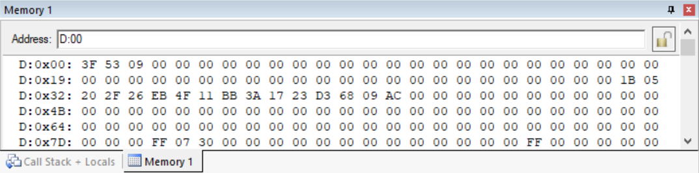

## 								<center>汇编指令编程</center>


<h5>
    <center>2021-4-21 </center>  
</h5>             


##### 

##### <center>混合1902</center>


##### <center>余丛杉</center>


##### <center>3190103165</center>


### 要求

> 在内存RAM 30H-3EH 中存储着一个数组A[15]，计算其校验和，并将其保存在3FH中。编写汇编指令实现该功能（A[15]={27,5,32,47,38,235,79,17,187,58,23,35,211,104,9 } ;需要编程给RAM赋值）


### 思路

+ 利用TABLE进行赋值
+ 对每个值进行累加
+ 用异或`XRL`每位取反

### 代码

```
		ORG		00H
		MOV 	DPTR, #TABLE	;source pointer
		MOV 	R0, #30H		;target address
		MOV 	R1, #0H			;sum
		MOV  	R3, #15			;counter
		MOV		A, #0H			;offset address
BACK:   MOVC	A, @A+DPTR		;get a byte from source
		MOV		@R0,A			;give the target address amplitude
		MOV		R2, A			
		MOV		A, R1
		ADD		A, R2			;addition
		MOV  	R1, A			
		INC		R0				;increment source pointer
		MOV		A, R0
		CLR	   	C				;clear bit c
		SUBB	A, #30H
		DJNZ	R3, BACK		;keep doing for 15 bytes
		
		MOV		A, R1			
		XRL		A, #0FFH		;negate
		MOV		3FH, A			;deposit value into 3FH
		
		ORG		30H
TABLE:	DB		27,5,32,47,38,235,79,17,187,58,23,35,211,104,9
		END	
```


### Memory

+ **运行前**



+ **运行后**



**校验和为AC**