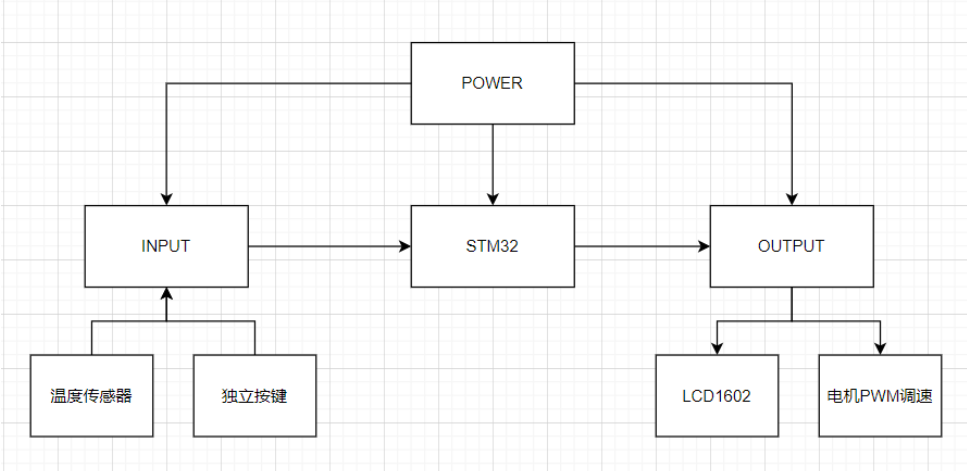
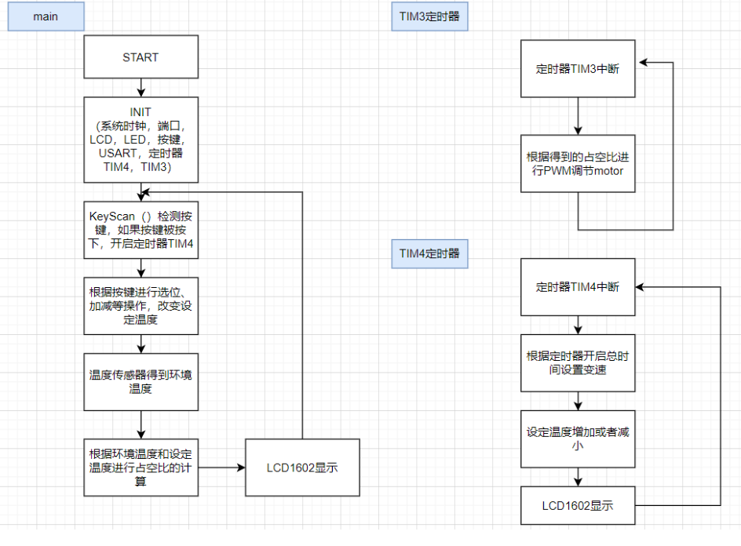

## 								
温控风扇综合实验

<h5>
    
2021-6-24
  
</h5>             

##### 

##### 
混合1902

##### 
余丛杉

##### 
3190103165

### 要求

> + 做一个控制系统，输入是温度传感器，输出是直流电机 
> + 设定一个初始值，以当前温度为参考，如果温度传感器超过初始值，则电机正转；如果低于设定值，则电机反转 
> + 当前值和初始值差异越大，则电机转速越快 
> + 完成按键检测和处理（数字加减） 
> + 将按键结果显示在数码管上 
> + 补充自己认为合理的设定

### 思路

+ 实现电机具有三种工作模式：正转、反转、不转。打开电源程序开始工作时，电机 不转，按一下 K3，电机开始转动，可视为空调开始工作；再按一下电机停止转动。 

+ 电机转速由输入 PWM 波占空比决定，经过实际测量，当输入 PWM 波占空比>70%时电 机才可以在没有外力矩作用下转动，因此将电机最小转速设为 70%。 

+ 利用 DS18B20 读取当前温度，与设定温度进行比较，当温度在设定的上下限范围内时， 计算电机的转速公式为： 

  ​				占空比 = 70% + (当前温度—设定温度)/ (温度上/下限—设定温度)

+ 温度上/下限在程序中设定，而设定温度可以通过按键控制，每按 K1 一次加 1℃，每按 K2 一次减 1℃。

+  8 位数码管 1、2、3 位显示当前温度（保留整数），4、5、6 位显示设定温度，8 位显示 PWM 波占空比

### 所用器件

STM32，DS18B20温度传感器，数码管，独立按键模块，直流电机

### 系统设计框图与流程图

+ 系统设计框图：

+ 系统设计的流程图：

### 实验心得

对于这次的实验要求，涉及到芯片、温度传感器、按键、显示、电机控制，是比较综合的，我的主要思路就是分开不同的模块进行设计，然后进行整合。

首先在主函数中，要进行按键的检测和温度的检测，然后送到数码管进行显示，这一部分的操作总体来说比较简单，与上一次的实验内容基本一致。

然后利用中断，TIM3中断负责处理电机的PWM调速，TIM3的定时频率非常高，然后每一百次定时有一定次数的motor对应的管脚是 1，驱动电机，由此来完成占空比的实现。

这几次实验锻炼了我的 32 芯片编程能力，以及对文件结构的理解，为之后的嵌入式高级实验打下良好的基础
